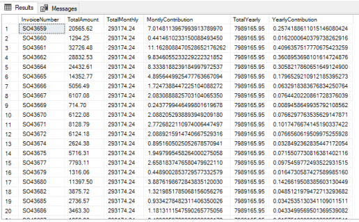

# Advanced Requests

## Get Date
~~~SQL
GETDATE()
CONVERT(date, GETDATE())
~~~

## Having
- Better filtering than *WHERE*.

~~~SQL
SELECT IdEmployee, COUNT(*) as [SalesCount]
FROM Invoices I INNER JOIN Employees E ON I.IdEmployee = E.ID
GROUP BY IdEmployee
HAVING COUNT(*) < 100
ORDER BY IdEmployee
~~~

## ISNULL
- Can replace empty table cell with a value(*default value*)
- Must be of same type.

~~~SQL
# ISNULL(colonne1, 'N/A') retournera 'N/A' si colonne1 est NULL, sinon retournera la valeur de colonne1.
SELECT
nom,
ISNULL(ville, code_postal) AS ville
FROM clients;
~~~

## COALESCE
- Same as ISNULL but can be given multiple values.
- Returns first non-null value.
~~~SQL
# Returns third_value
SELECT COALESCE(NULL, NULL, 'third_value', 'fourth_value');
~~~

## EXISTS/NOT EXISTS
- See if recording exists or not.
- *Select 1* usually used for *EXISTS*
~~~SQL
SELECT ID, FirstName, LastName
FROM Employees E
WHERE EXISTS
(
SELECT 1
FROM Invoices
WHERE IdEmployee = E.ID
)
~~~

## WHEN
- Acts like a *Switch case*.
- Returns multiple values depending on column.

### WHEN SIMPLIFIED
~~~SQL
SELECT
[colonnes],
CASE colonne
WHEN valeur1 THEN valeur2
[WHEN... THEN...]
[ELSE valeur3]
END nom_colonne_CASE
[colonnes...]
FROM
...;
~~~
### WHEN NON-SIMPLIFIED
- Allows for passing more complex values such as where.
~~~SQL
SELECT
[colonnes],
CASE
WHEN condition1 THEN valeur1
[WHEN condition2 THEN valeur2]
[WHEN... THEN...]
[ELSE valeur3]
END nom_colonne_CASE
[colonnes...]
FROM
...;
~~~

### REAL WORLD EXAMPLE
~~~SQL
--Affiche un label en fonction de valeurs statiques
SELECT FirstName, LastName,
CASE Gender
WHEN 'M' THEN 'Homme'
WHEN 'F' THEN 'Femme'
WHEN 'O' THEN 'Autre'
ELSE 'Non spécifié'
END AS [FormattedGender]
FROM Customers
~~~

~~~SQL
--Affiche le montant total en fonction du statut de la facture
SELECT
SUM(CASE IdInvoiceStatus
WHEN 1 THEN TotalAmount -- Quote
WHEN 2 THEN TotalAmount -- Open
ELSE 0
END) AS [Unpaid],
SUM(CASE
WHEN IdInvoiceStatus >= 3 THEN TotalAmount -- Paid, Shipped, Delivered
ELSE 0
END) AS [Paid],
SUM(TotalAmount) as [GrandTotal] --Sum of all idInvoiceStatus
FROM Invoices
~~~

~~~SQL
--Case when avec prédicat peut se faire sur des fonctions
d'agrégation
SELECT SUM(P.Cost) AS [Total],
CASE
WHEN SUM(P.Cost) <= 100 then 'Abordable'
WHEN SUM(P.Cost) <= 500 then 'Dispendieux'
ELSE 'Hors de prix'
END AS [PriceRange]
FROM InvoiceLines IL INNER JOIN Products P ON IL.IdProduct = P.ID
GROUP BY IL.IdInvoice
~~~

## CROSS JOIN
- Used when searching for all possible values between two tables.

~~~SQL
SELECT *
FROM Meals M CROSS JOIN Drinks D
~~~

# TRIGGERS

- A stocked procedure that is automatically executed whenever certain events happen.
- Notably used for:
	1. Keeping a list of the modifications made to a table.
	2. Compile access statistics to tables.
	3. Control operation permissions depending on context.
	4. Exert certain constraints on data.

## TRIGGER CREATION
~~~SQL
CREATE TRIGGER trigger_name
ON { table name or view name }
[ WITH <Options> ]
{ FOR | AFTER | INSTEAD OF }
{ [INSERT], [UPDATE] , [DELETE] }
~~~

### FOR & AFTER
- Cannot define a *FOR* or *AFTER* for a *VIEW*.
- Makes it so that the code of the trigger is executed after a certain action is completed.

~~~SQL
CREATE TRIGGER tr_maj_total_reservations
ON Réservations
AFTER DELETE
AS
BEGIN
UPDATE H
SET Total_Réservations = (
SELECT COUNT(*)
FROM Réservations
WHERE ID_Hôtel = H.ID_Hôtel
)
FROM Hôtels H
INNER JOIN deleted D ON H.ID_Hôtel =
D.ID_Hôtel
END
~~~

### INSTEAD OF
- Replaces Action and and the trigger must handle the action.

~~~SQL
CREATE TRIGGER tr_maj_derniere_vente
ON Ventes
INSTEAD OF INSERT, UPDATE
AS
BEGIN
UPDATE V
SET MontantTotal = V.Quantite * V.PrixUnitaire,
DerniereVente = V.DateVente
FROM Ventes V
INNER JOIN inserted I ON V.ID_Vente = I.ID_Vente
INSERT INTO Ventes (ID_Client, ID_Voiture, DateVente, MontantTotal)
SELECT ID_Client, ID_Voiture, DateVente, Quantite * PrixUnitaire
FROM inserted
UPDATE Clients
SET DerniereVente = V.DateVente
FROM Clients C
INNER JOIN Ventes V ON C.ID_Client = V.ID_Client
END
~~~

## IMPORTANT!
- In other DATABASES, Using *FOR INSERT* allows changing data before insertion into the table.
- THIS BEHAVIOR IS **NOT** PRESENT IN SQL SERVER. 
- USE THIS INSTEAD: 
~~~SQL
INSTEAD OF
~~~

## RECURSIVE TRIGGER
- This works but if all employees have superiors, the loop will be infinite.
- Use **IF/ELSE** instead.
~~~SQL
CREATE TRIGGER tr_maj_salaire_employé
ON Employés
AFTER UPDATE
AS
BEGIN
UPDATE Employés
SET Salaire = Salaire * 1.1
WHERE ID_Employé IN (
SELECT Supérieur_Hiérarchique_ID
FROM inserted
)
END
~~~

## IF/ELSE
- Like IF Statement in other programming languages
~~~SQL
IF Boolean_expression
{ sql_statement | statement_block }
[ ELSE
{ sql_statement | statement_block } ]
~~~

## DECLARE
- It is possible to declare variables in SQL:
~~~SQL
DECLARE @variableName TYPE;
~~~

## PRINT
- Will display a message in SMMS **"Messages"** tab.

## RAISERROR
- Alternative to print which displays an Error Message.
- Here are the arguments required:
	1. **Message**: The message one wants to print.
	2. **Severity**: A number between 0 and 25 which defines its severity. All severities are treated differently by SSMS.
	3. **State**: A number between 0 and 255 to distinguish one error from another. Use value of *1* as default.
- It is important to note that variables can be used in the RAISERROR.
~~~SQL
RAISERROR('Does not compute', 0, 1);
~~~

## UPDATES WITH JOIN
- Generally used when creating a temporary table and wanting to update data with those values.

~~~SQL
--Imaginons une routine de travail qui recalcule les coûts pour certains produits
SELECT P.ID, (P.Cost / 2) AS [RevisedCost] INTO #tempTable
FROM BikeProducts B INNER JOIN Products P ON B.ID = P.ID
WHERE B.IsUsed = 1
--Imaginons ensuite un autre processus de code qui doit mettre à jour en fonction de ce qu'il y a dans #tempTable
UPDATE P SET P.Cost = T.RevisedCost
FROM Products P INNER JOIN #tempTable T ON P.ID = T.ID
~~~

## OVER/PARTITION BY
- Function creation to regroup data without group by combined with Where Clause.

~~~SQL
--Affiche pour une facture, son total, le total de vente dans le mois,
--en % la contribution mensuelle, le total de vente de l'année, en % la
contribution annuelle
SELECT
InvoiceNumber,
TotalAmount,
SUM(TotalAmount) OVER (PARTITION BY
YEAR(InvoiceDate),
MONTH(InvoiceDate)
) [TotalMonthly],
(TotalAmount / SUM(TotalAmount) OVER (PARTITION BY
YEAR(InvoiceDate),
MONTH(InvoiceDate)
)) * 100 AS [MontlyContribution],
SUM(TotalAmount) OVER (PARTITION BY
YEAR(InvoiceDate)
) [TotalYearly],
(TotalAmount / SUM(TotalAmount) OVER (PARTITION BY
YEAR(InvoiceDate)
)) * 100 AS [YearlyContribution]
FROM Invoices
WHERE IdInvoiceStatus IN (3,4,5) --Paid, Shipped, Delivered
ORDER BY InvoiceNumber ASC
~~~

