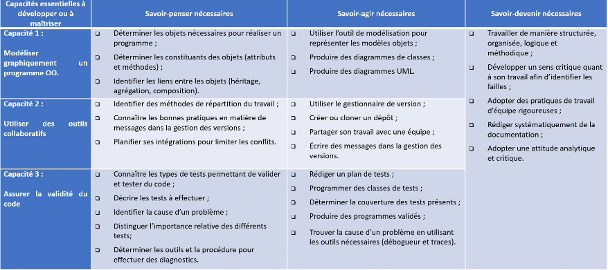
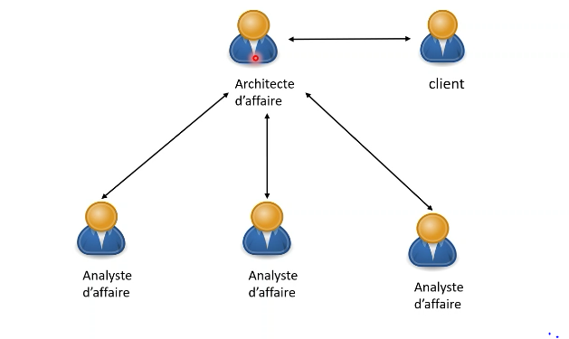
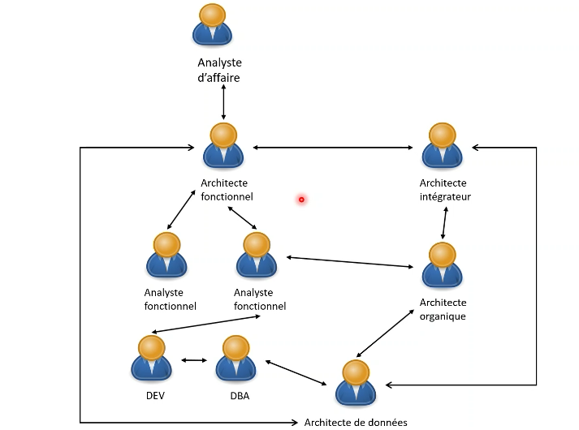
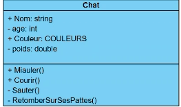

# TODOS
- [ ] Review PowerPoint of different diagrams 📅 2023-02-10
- [ ] Modelisation HW 📅 2023-02-15

**EVERYTHING IS ON TEAMS**
# Week 1:
## Introduction
### Objectif du cours:

Three Main Points: 
1. Modélisation *UML*
2. Travail Collaboratif: Development team etc.
3. Test automatisés du code applicatif (*Test Unitaire*)

- Complementary course to OOP
- How to keep aplications stable.
- Basically all team related issues for building a reliable product.
- How to make links between objects using a *UML*.
- Will show how to resolve conflicts in collaborative work.
- Working in different timezones may be a challenge.

- Will learn how to use **Git**. 
- Which tools will help us create diagnostic and bug research tests
- How to create test methods and determine
- This code works but **Here are its limits**.
- Rigourours work ethic.
- **Documentation is key**: must be second nature.
- *Visual Paradigm* is used for UML Creation.
- **TDD**: Test Driven Development.
- Will be using C# for development and VS 2022 with .Net6 as Quebec is mostly a CSharp market.

## Assignements
- OneDrive File with explicative video. 

## UML Introduction

- Client has demands and *Architecte d'Affaires* thinks of big picture: I.E not which technologies are used.
- *Analyste D'Affaire* each works on its own department. For example, one works for the payment system. The other works on the security does not work on the technical side.

- Architecte Fonctionnelle is the bridge between developpers and Non-Tech Savvy *Analyste d'affaires.
- Application Speed: 2 factors, *Base de données* and *applicative solution*.
- **DBA: DataBase Administrator**: works with dev to verify the database can be properly used and integrated into application. Not able to code but be able to understand the programming. Has worked with different database systems.
- **Analyste Fonctionnel**: Here is the design of the product. Asks **DEV** to code it.
- Always Bidirectionnal arrows, connection goes both ways.
- **Architecte organique**: Head of certain department.
- **Architecte intégrateur**: Chef d'orchestre. Make sure all components mesh well together. Usually an organic architect that is very senior.
- **GIT is a tool, it is not a LANGUAGE**.
-  **UMLs** are used to communicate, an image is worth 1000 words.
- Simple, concise, and non-tech savvy Analyste d'affaire can the rest can clearly understand what needs to be done.
### UML Alternatives
- **Buisness Process Model and Notation(BPMN)**: used for buisness. Similar to UML and all can understand aswell.
- Other alternatives exist but they are all simliar.

## Diagrams

Does it work? It depends on the reason one chose.

Attributes are private, properties are public.

public internal is only public in said project, not to other **External Classes**

Rreference class in enumeration

Methods Majuscule

