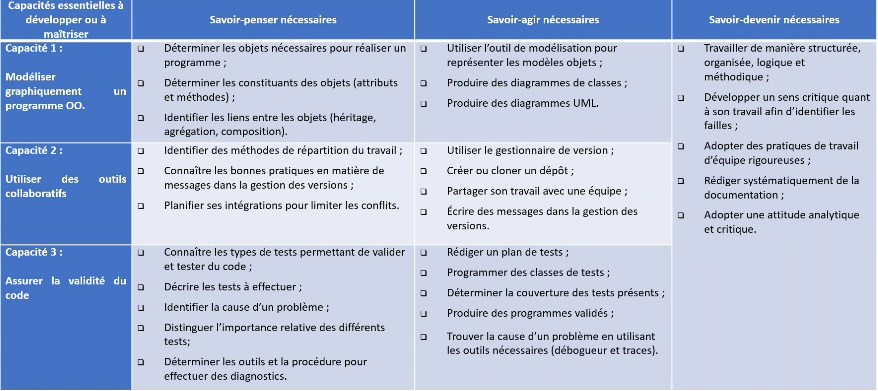

# TODOS

# Week 1:

## Introduction

### Objectif du cours:

Three Main Points: 
1. Modélisation *UML*
2. Travail Collaboratif: Development team etc.
3. Test automatisés du code applicatif (*Test Unitaire*)

- Complementary course to OOP
- How to keep aplications stable.
- Basically all team related issues for building a reliable product.
- How to make links between objects using a *UML*.
- Will show how to resolve conflicts in collaborative work.
- Working in different timezones may be a challenge.

- Will learn how to use **Git**. 
- Which tools will help us create diagnostic and bug research tests
- How to create test methods and determine 
