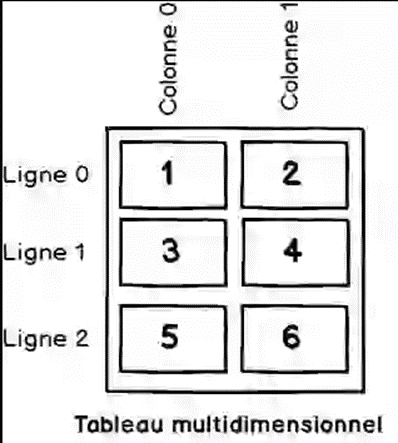

# MultiDimensional Tables

- Un tableau multidimensionnel est un tableau qui contient des éléments adressés par deux indices ou plus (au lieu d'un seul dans les tableaux unidimensionnels).

La déclaration suivante crée un tableau à deux dimensions composé de trois lignes et deux colonnes.

int[,] array2D = new int[3, 2];

On peut ensuite remplir le tableau en utilisant les index comme suit :

**array2D[0,0] = 1;**

**array2D[0,1] = 2;**

**array2D[1,0] = 3;**

**array2D[1,1] = 4;**

**array2D[2,0] = 5;**

**array2D[2,1] = 6;**

Il est également possible d’initialiser le tableau lors de la création :

~~~c#
int[,] array2Da = new int[3, 2] { { 1, 2 },

                                  { 3, 4 },

                                  { 5, 6 }};

~~~

### Parcourir un tableau à plusieurs dimensions

Pour parcourir un tableau à plusieurs dimensions, il suffit d’utiliser une boucle par dimension. Pour un tableau à deux dimensions, il faut donc une boucle dans une boucle.

~~~c#
for (int i = 0; i < 3; i++)

{

    for (int j = 0; j < 2; j++)

    {

        _Console.WriteLine("array2D[{0},{1}] = {2}", i, j, array2D[i, j]);

    }

}
~~~

La boucle **foreach** offre une façon simple de parcourir un tableau à plusieurs dimensions.

~~~c#
foreach(int i in array2D)

{

    Console.WriteLine(i);

}
~~~

Toutefois, l’utilisation d’une boucle for imbriquée vous permet de mieux contrôler l’ordre dans lequel les éléments du tableau sont traités.

