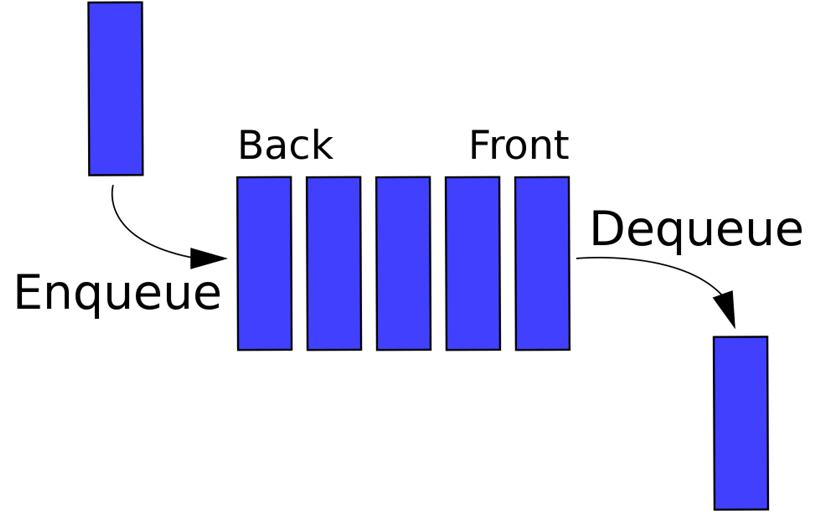

# Queues/Files

- Queues are a *"first in, first out" (FIFO)* data structure, which means that items are removed from the queue in the order in which they were added.
- In C#, the Queue<T> class is commonly used to implement a queue in an application.

## Important characteristics

1. **Order of addition**: Items are removed from the queue in the order in which they were added, which means that the first item added will be the first to be removed *(FIFO)*.
2. **Size limited**: *Queues* can have a size limit, which means that it is possible to define the maximum number of elements that the queue can contain. If the queue is full, it is impossible to add new elements without removing them first
3. **Generic Type**: The *Queue<T>* class in C# is a generic type, which means you can define the type of elements the *queue* can hold. This makes it possible to create more flexible and reusable queues.
4. **Thread-Safe**: The *Queue<T>* class in C# is thread-safe, meaning it can be safely used in multi-threaded applications without risk of data corruption.
5. **Optimized for Extraction and Addition**: This optimization makes them effective for applications requiring sequential data processing. 

## Popular Operations

### Integer Queue Creation
~~~c#
Queue<int> nombres = new Queue<int>();
~~~

### Adding Elements in Queue
~~~c#
nombres.Enqueue(1);
nombres.Enqueue(2);
nombres.Enqueue(3);
nombres.Enqueue(4);
nombres.Enqueue(5);
~~~

#### Output
~~~c#
nombres == { 1, 2, 3, 4, 5 }
~~~

### Returning the First element in the Queue
~~~c#
int premier = nombres.Peek();
Console.WriteLine(premier);
~~~

#### Output
~~~c#
premier == 1
~~~

### Returning the First element in the Queue and Deleting It
~~~c#
int premier2 = nombres.Dequeue();
Console.WriteLine(premier2);
~~~

#### Output
~~~c#
premier2 == 1
nombres == { 2, 3, 4, 5 }
~~~

### Return the number of elements in the Queue
~~~c#
int nbElements = nombres.Count;
Console.WriteLine(nbElements);
~~~

#### Output
~~~c#
nbElements == 4
~~~

### Step through the queue without deleting items
~~~c#
foreach (int nombre in nombres)
{
    Console.WriteLine(nombre);
}
~~~

### Step through the Queue while deleting the items
~~~c#
while (nombres.Count > 0)
{
    int nombre = nombres.Dequeue();
    Console.WriteLine(nombre);
}
~~~
