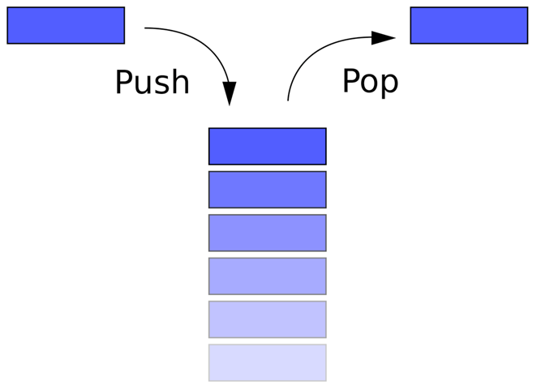

# Stacks
- The **stack** is a *logical representation* of a stack of objects which can only be accessed from above (an object is placed on the stack or the element above is removed). This structure is also called *FILO (first in, last out) or LIFO (last in, first out)*.

Typically, a **Stack** has two *public* methods:
1. **Push(element)**: Adds an element to the top of the **stack**.
2. **Pop()**: Returns the first element of the *stack*.

Important Characteristics:
- **Generic Type**: Stacks in C# are generic type, which means they can hold any type of data, including custom types.
- **Adding and removing items only from one end**: Stacks only allow adding or removing items from the top end, which is called "stacking".
- **Quick Accessibility to Elements**: *Stacks* provide quick access to *elements* at the top of the stack, which makes them very useful for algorithms such as problem solving.
- **Limited number of items**: Stacks have a limited size and cannot contain an unlimited number of items.
- **Performance**: Stacks in C# are generally very fast for basic operations such as adding and removing elements, which makes them useful for applications that require fast performance.

## Popular Operations

### Creation of a Stack of Integers
~~~c#
Stack<int> nombres = new Stack<int>();
~~~

### Adding elements to a Stack
~~~c#
nombres.Push(1);
nombres.Push(2);
nombres.Push(3);
nombres.Push(4);
nombres.Push(5);
~~~

#### Output
~~~c#
nombres == { 5, 4, 3, 2, 1 }
~~~

### Returning the Element on top of the Pile
~~~c#
int dernierEntre = nombres.Peek();
Console.WriteLine(dernierEntre);
~~~

#### Output
~~~c#
dernierEntre == 5
~~~

### Returning the Element on top of the Stack and Deleting it
~~~c#
int dernierEntre2 = nombres.Pop();
Console.WriteLine(dernierEntre2);
~~~

#### Output
~~~c#
dernierEntre == 5
nombres == { 4, 3, 2, 1 }
~~~

### Returning the number of elements in the Stack
~~~c#
int nbElements = nombres.Count;
Console.WriteLine(nbElements);
~~~

#### Output
~~~c#
nbElements == 4
~~~

### Going through the Stack without deleting an item
~~~c#
foreach (int nombre in nombres)
{
    Console.WriteLine(nombre);
}
~~~

### Going through the Stack and Deleting the Elements
~~~c#
while (nombres.Count > 0)
{
    int nombre = nombres.Pop();
    Console.WriteLine(nombre);
}
~~~
