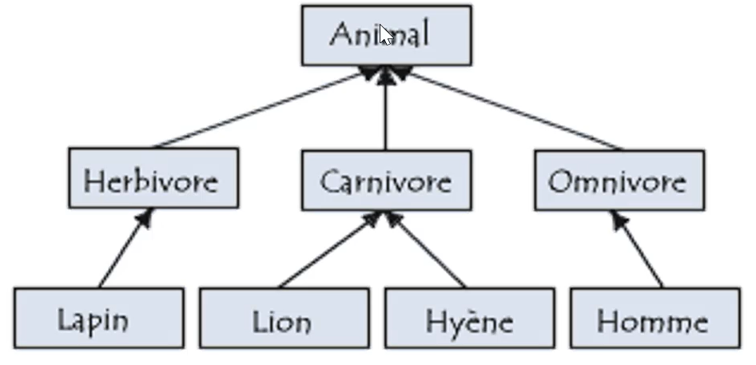
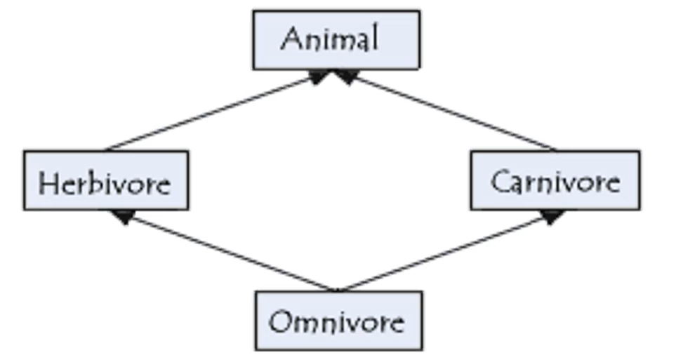
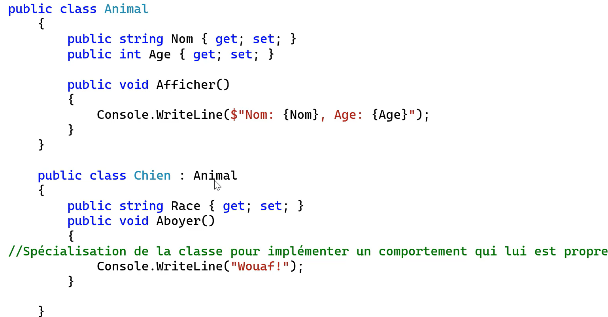

# Inheritance
- One of the fundamental principles of programming.
- Allows for one class to inherit attributes of another.
- This principle therefore makes it possible to create new classes that reuse, extend and modify the behavior defined in other classes.
- The class whose members are *inherited* is named **parent class or base class** and the class that *inherits* those members is named **child class or derived class**.

## When to use inheritance?
- Inheritance promotes reuse. As soon as several classes differ from the same behaviors and properties, they must inherit these from a parent. But how does one know which classes are to be inherited before writing the code?
- **Derived Classes** must repond to the *is a* phrase  
- A dog *is an* animal
- A cat *is an* animal
- A Truck *is a* vehicle

- Classes can use the same code as the parent classes.

# Example

- Start with animal class and define what is common between all animals. 
- Then, go more specific... In this example, The types of diet an animal can have. 
- Inheritance is **transitive**. This means that the Type D can inherit from Type C which inherits from Type B and inherits from the Base Class A.
- Members of Type A are available in Type D.

- Inheritance from multiple classes does not exist in C# like in Java.  

# Actually coding Inheritance in CSharp

- If parent class has constructor, one must use this one to create object.

~~~c#
	public class Chien : Animal{
		public string Race{get; set;}

		public Chien(string nom, int age, string race) : base (nom, age){
			Race = race;
		}
	}
~~~  

# Visibility
- **Private**: Accessible only in the class in which it was declared.
- **Protected**: Accessible only in the class in which it was declared and its decendants. It is not availble when creating  a new instance.
- **Public**: Members are accessible anywhere in the code.

# Implicit Inheritance
- All variable types are objects(instances of classes).
- An example of this is when calling the ToString Method. Many methods become available to the user.
- All inherited objects can be treated as an object of the base class.

# Ending Inheritance

- **seal** is used to define the end of inheritance.

~~~c#
public sealed class NissanLeaf : VoitureElectrique{
	public NissanLeaf(string marque, string modele, int annee, int nbPortes, int autonomie)
	: base (marque, modele, annee, nbPortes, autonomie){

	}
}
~~~

## Important!!
- Creatr constructor with minimal attrubutes so as to be more easily implemented by Inherited Classes.
